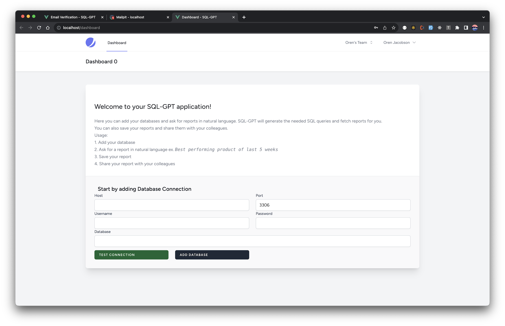
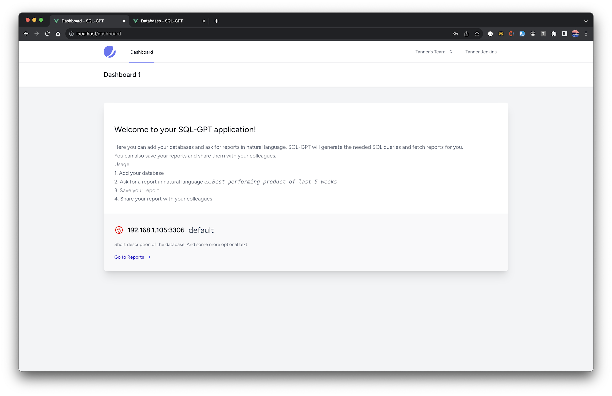
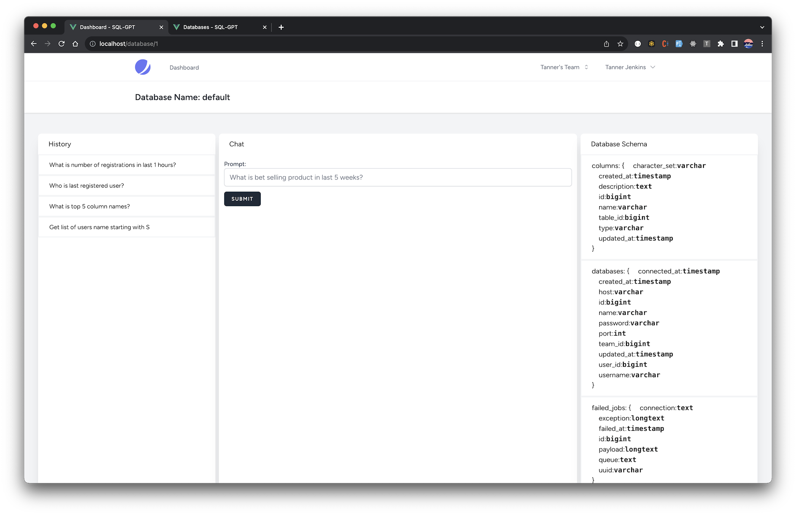
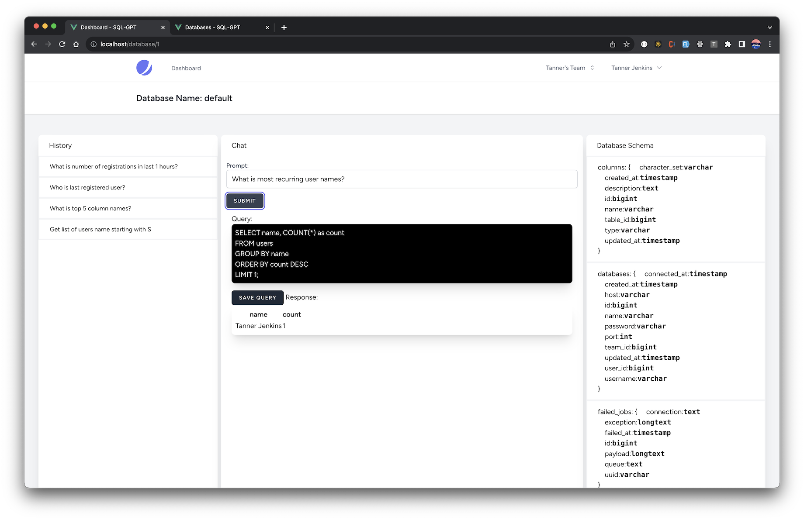

## Seaqull

SQL report generation using OpenAI GPT-3 model. 

### Installation
1. Clone this repository
2. Clone Laradock repository
3. Make changes on the .env file in Laradock repository
4. Make changes on the .env file in this repository
5. Make changes on nginx/sites/default.conf in Laradock repository
6. Fire up the docker containers 🔥🔥🔥

### TODO
- [x] Create table for the sql response
- [ ] Create chart for the sql response
- [ ] Create image response type for the sql response

### Usage
1. Fill your database credentials in dashboard page
2. Test the connection
3. Save the database credentials
4. Go to the query page
5. Enter your prompt
6. Get the response with query and response
7. You can also save the query and response for future use

### Screenshots

